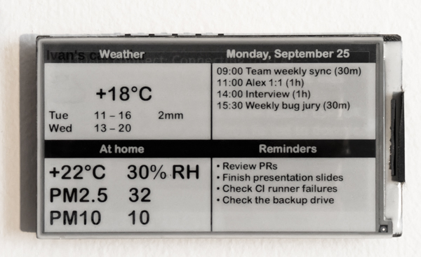

# E-ink dashboard app

This is an app for the [LilyGo T5 4.7" e-ink board](https://t5-47-t5-47-plus.readthedocs.io/en/latest/) which downloads a PNG file from the server and displays it on the screen.

The server (not part of this repository) is responsible for generating a PNG file with the information you'd like to see in the dashboard. This makes the application running on the e-ink board fairly simple.

## Building

This project is an [ESP-IDF](https://github.com/espressif/esp-idf) application.

1. Create a `.env` file — see [.env.sample](.env.sample) for a template.
2. `idf.py build flash monitor` as usual.

## Configuration (`.env`)

Variable | Description
-------- | -----------
PNG_URL  | URL where the PNG file is hosted
HTTP_HEADERS | Additional HTTP headers to pass to the server. For example, Authentication header with an access token.
WIFI_SSID | Wi-Fi network name
WIFI_PASSWORD | Wi-Fi password
REFRESH_INTERVAL_MIN | How often to refresh the display, in minutes

